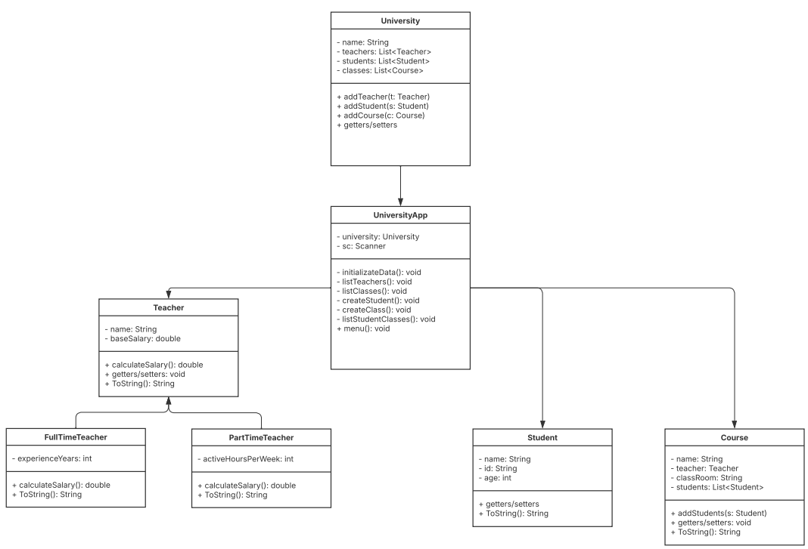

# University Management System

A Java application to track university classes, teachers, and students.
Features include listing professors, managing classes, adding students, and searching by student ID.

## Structure

Uses object-oriented principles: encapsulation, inheritance, polymorphism.
Organized in packages for models and application logic.
Includes a menu for user interaction.

How to Run:

- Clone the repository.
- Build with Maven:
- mvn clean install
- Run the main class:
- java -jar target/University.jar

Requirements:

- Java 17+
- Maven

Author: jhonleison26

